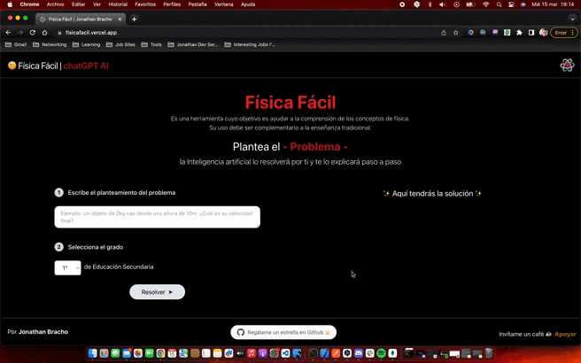

# Física Fácil 📚🚀

Física Fácil is a React, TypeScript, and TailwindCSS-based web application designed to make physics problem-solving simple and enjoyable for students! 🎓💡

## Table of Contents

1. [Introduction](#introduction)
2. [Features](#features)
3. [Installation and Setup](#installation-and-setup)
4. [Usage](#usage)
5. [Contributing](#contributing)
6. [License](#license)

## Introduction

Physics can be a challenging subject for many students. Física Fácil aims to help students by providing an interactive platform where they can input their physics problems and receive step-by-step solutions generated by AI. 🤖🧪

As a Teacher my goal is to make learning physics more accessible, engaging, and enjoyable for students, regardless of their background or skill level. 🌟

<div align='center'>


</div>

## Features

- User-friendly interface 🌈
- Step-by-step AI-generated solutions 🧠
- Support for different education levels of high school 🎓
- Responsive design for various devices 📱💻

## Installation and Setup

To get started with Física Fácil, follow these steps:

1. Clone the repository:

```bash
git clone https://github.com/JonathanJB88/AIEasyPhysics/
```

2. Change into the project directory:

```bash
cd AIEasyPhysics
```

3. Install the required dependencies:

```bash
npm install
```

3. Run the development server:

```bash
npm start
```

Now, you can access the application at http://localhost:3000.

## Usage

- Write the physics problem statement in the designated text area. 📝
- Select the appropriate education level from the dropdown menu. 🎓
- Click the "Resolve" button to generate the solution. 🚀
- Review the step-by-step solution provided by the AI. 🧠

## Contributing

Contributions from the community are welcomed! If you're interested in contributing, please follow these steps:

- Fork the repository.
- Create a branch for your changes.
- Make your changes and commit them.
- Push your changes to your fork.
- Submit a pull request.

For more details, please refer to the CONTRIBUTING.md file.

## License

Física Fácil is licensed under the MIT License. Feel free to use, modify, and distribute the code as needed.
